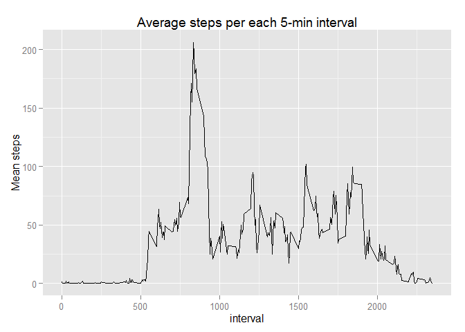

# Reproducible Research: Peer Assessment 1


## Loading and preprocessing the data

```r
  setwd("c:/coursera/reproduce/")
  unzip("repdata-data-activity.zip")
  suppressPackageStartupMessages(library(data.table))
  library(ggplot2)
  activity <- data.table(read.csv("activity.csv",colClasses=c("numeric","Date","numeric")))
```


## What is mean total number of steps taken per day?

```r
   daily <- activity[, list(sum.steps=sum(steps, na.rm=TRUE)), by=date]
   
    
   ggplot(daily, aes(x=date, y=sum.steps, na.rm=TRUE)) + 
          geom_histogram(stat="identity") +
          xlab("Steps (Total number)")+
          ggtitle("Total steps per day")
```

 

```r
   mean <- as.character(daily[, round(mean(sum.steps, na.rm=T),2)])
   median <- as.character(daily[, median(sum.steps, na.rm=T)])
```

The mean total number of steps taken per day is  **9354.23** and the median is **10395**.

## What is the average daily activity pattern?

```r
inter <- activity[, list(mean.steps=mean(steps, na.rm=TRUE)), by=interval]

ggplot(inter,aes(x=interval,y=mean.steps))+geom_line()+
  ggtitle("Average steps per each 5-min interval")+
  ylab("Mean steps")
```

 


```r
a <-inter[inter[,which.max(mean.steps)]]$interval
b <-inter[inter[,which.max(mean.steps)]]$mean.steps
```
The 5-minute interval with the highest number of steps taken is 835 with average of 206.1698 steps taken.

## Imputing missing values

```r
(miss <- sum(!complete.cases(activity)))
```

```
## [1] 2304
```

In the data 2304 rows have missing values. 
The strategy selected to impute missing values is to use the average for this interval across all days. 


```r
setkey(inter, interval) ;setkey(activity, interval)
imputed <- inter[activity]
invisible(imputed[is.na(steps), steps := mean.steps])
invisible(imputed[, mean.steps :=NULL])
```


```r
   daily2 <- imputed[, list(sum.steps=sum(steps)), by=date]
   
    
  ggplot(daily2, aes(x=date, y=sum.steps, na.rm=TRUE)) + 
          geom_histogram(stat="identity") +
          xlab("Steps (Total number)")+
          ggtitle("Total steps per day after imputing")
```

 

```r
   mean2 <-   as.character(daily2[, round(mean(sum.steps, na.rm=T),  2)])
   median2 <- as.character(daily2[, round(median(sum.steps, na.rm=T),2)])
```

After imputing the mean total number of steps taken per day is  **10766.19** (compared to **9354.23** before imputing ) and the median is **10766.19** (compared to **10395** before imputing ).


## Are there differences in activity patterns between weekdays and weekends?


```r
imputed[, wd :=factor(ifelse(weekdays(date) %in% c("Saturday", "Sunday"), 
                             "weekend", 
                             "weekday"))]
```

```
##        interval  steps       date      wd
##     1:        0  1.717 2012-10-01 weekday
##     2:        0  0.000 2012-10-02 weekday
##     3:        0  0.000 2012-10-03 weekday
##     4:        0 47.000 2012-10-04 weekday
##     5:        0  0.000 2012-10-05 weekday
##    ---                                   
## 17564:     2355  0.000 2012-11-26 weekday
## 17565:     2355  0.000 2012-11-27 weekday
## 17566:     2355  0.000 2012-11-28 weekday
## 17567:     2355  0.000 2012-11-29 weekday
## 17568:     2355  1.075 2012-11-30 weekday
```

```r
inter2 <- imputed[, list(mean.steps=mean(steps, na.rm=TRUE)), by=list(wd, interval)]


ggplot(inter2,aes(x=interval,y=mean.steps))+geom_line()+
  ggtitle("Average steps per each 5-min interval after imputing")+
  ylab("Mean steps") +
  facet_grid(wd ~ .)
```

 

```r
ggplot(inter2,aes(x=interval,y=mean.steps, group=wd, color=wd))+geom_line()+
  ggtitle("Average steps per each 5-min interval after imputing (alternative view")+
  ylab("Mean steps") 
```

 


